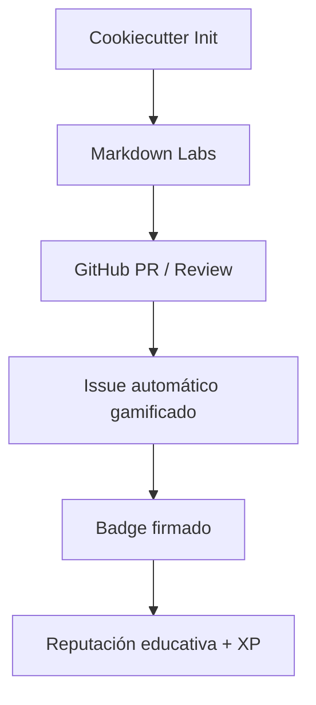

# 🧩 ATLANTYDE Starter Kit – Open Educational Infrastructure

Bienvenido al **kit oficial de lanzamiento de proyectos educativos trazables**, desarrollado por ATLANTYDE Labs para fomentar:

- Aprendizaje autodirigido y verificado
- Contribución técnica con impacto social
- Formación alineada con necesidades del mercado europeo

---

## 🔧 ¿Qué es ATLANTYDE Starter Kit?

Una infraestructura modular y personalizable para lanzar proyectos educativos con:

✅ **Markdown como origen de verdad**  
✅ **Automatización CI/CD con GitHub Actions**  
✅ **Insignias digitales firmadas (SVG + GPG)**  
✅ **Gamificación neurodidáctica (XP + Labs)**  
✅ **Despliegue multiplataforma (GitHub Pages / IPFS)**  
✅ **Estándar SDLC y reputación trazable**

---

## 🧪 Tecnologías soportadas

- Astro Content Collections
- MkDocs + Docusaurus
- GitHub Actions
- Cookiecutter
- GPG + firma de logs
- IPFS (opcional)

---

## 🧭 ¿Para quién es esto?

| Perfil             | Beneficio Clave                                      |
|--------------------|------------------------------------------------------|
| Educadores          | Crear itinerarios formativos guiados y certificables|
| Estudiantes         | Validar su aprendizaje en GitHub con badges         |
| Desarrolladores     | Participar en Labs abiertos y recibir XP            |
| Instituciones       | Lanzar portales educativos sin fricción técnica     |

---

## 🚀 ¿Cómo empezar?

1. Instala [cookiecutter](https://cookiecutter.readthedocs.io/)
2. Ejecuta el generador:

```bash
cookiecutter gh:atlantyde/cookiecutter-atlantyde-template
```

3. Activa tus Labs y workflows desde GitHub Actions:
   - `Launch Missions`
   - `Sign and Publish Badge`

---

## 🔁 Flujo de trabajo estándar



---

## 📦 Repositorios clave

- [cookiecutter-atlantyde-template](https://github.com/atlantyde/cookiecutter-atlantyde-template)
- [atlantyde-gamified-repo](https://github.com/atlantyde/atlantyde-gamified-repo)
- [atlantyde-badge-issuer](https://github.com/atlantyde/atlantyde-badge-issuer)

---

## 🌍 Publicación recomendada

Puedes subir este Starter Kit a:
- [GitHub Topics: education, gamification, SDLC, open-source-learning]
- [Devpost.com](https://devpost.com/) → como infraestructura educativa escalable
- [European Open Education Resources](https://oercommons.org/)
- [Codeberg, Gitea, GitLab (EU instances)]

---

## 🛡️ Licencia y sello

MIT License  
✅ Validado por AtlantydeBot  
✅ Firmado con `.atlantyde.yaml`

---

## 📫 Contacto

**ATLANTYDE Labs**  
📧 atlantenauta@atlantyde.org  
🌐 https://atlantyde.org

> *“Un badge firmado vale más que mil PDFs.”*

