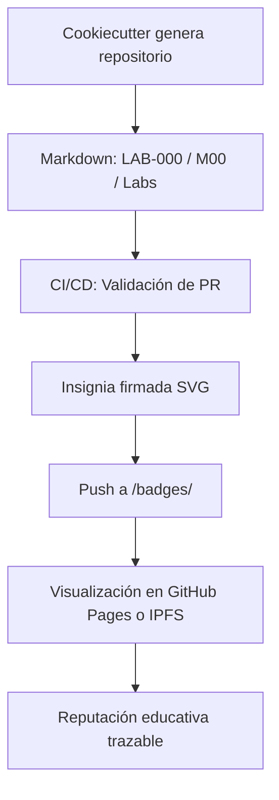

# 🧭 ATLANTYDE Labs – Generador Universal de Proyectos Educativos y Éticos

Este repositorio representa el **sello de garantía educativo y técnico de ATLANTYDE**, que permite generar, firmar y gamificar proyectos basados en tecnologías abiertas, trazabilidad digital y aprendizaje significativo.

---

## 🎯 Objetivo

Generar automáticamente repositorios educativos que:
- Utilicen Markdown como **origen de verdad**
- Se integren con frameworks como Astro, MkDocs o Docusaurus
- Incluyan **gamificación por Labs**
- Entreguen **insignias digitales firmadas**
- Se desplieguen fácilmente en GitHub Pages o IPFS
- Garanticen trazabilidad educativa y reputación verificable

---

## ⚙️ Tecnologías integradas

| Módulo           | Descripción                                        |
|------------------|----------------------------------------------------|
| Cookiecutter      | Plantilla oficial para nuevos repositorios        |
| Astro Content     | Visualización de Labs desde Markdown              |
| GitHub Actions    | Automatización CI/CD, emisión y firma de badges  |
| MkDocs/Docusaurus | Alternativas de documentación                    |
| GPG               | Firma de insignias y trazabilidad                 |
| IPFS (opcional)   | Publicación descentralizada de pruebas educativas|

---

## 🧪 Componentes del Sistema

### 1. `cookiecutter-atlantyde-template`
Generador de repositorios con:
- `src/astro/atlantyde/content/labs/` como núcleo
- Tests, CI/CD, Markdown y flujos gamificados
- `README`, `LICENSE`, `CODE_OF_CONDUCT`, `.atlantyde.yaml`

### 2. Workflows de GitHub
- `launch_missions.yml`: Crea issues personalizados tras un fork
- `sign_and_publish.yml`: Emite y firma badges automáticamente tras aprobación de PR

### 3. Firmas ATLANTYDE
- Badges `.svg` con hash SHA-256
- Logs firmados `.txt` (PGP simulados o reales)
- Visualización en `index.html` o IPFS

---

## 🔁 Ciclo de vida SDLC educativo



---

## 🛡️ Sello de Garantía ATLANTYDE (`.atlantyde.yaml`)

```yaml
project: "{{ cookiecutter.project_slug }}"
issuer: "ATLANTYDE Labs"
validated_by: "AtlantydeBot"
features:
  - origen: markdown firmado
  - tipo: educativo open source
  - labs: gamificados + certificados
  - deploy: astro/mkdocs/docusaurus
  - insignias: svg + .asc
```

---

## 📈 Impacto esperado

| Nivel        | Resultado esperado                                       |
|--------------|----------------------------------------------------------|
| Alumno       | Reputación educativa en GitHub + badges verificados     |
| Colaborador  | Trayectoria rastreable, validación por contribución     |
| Empresa      | Selección de talento con trazabilidad real              |
| Institución  | Certificación de aprendizaje activo y trazable          |

---

## 🧪 ¿Cómo empezar?

```bash
cookiecutter gh:atlantyde/cookiecutter-atlantyde-template
```

Luego, ejecuta los workflows desde GitHub Actions:
- `Launch Missions`
- `Sign and Publish Badge`

---

## 📬 Contacto

**ATLANTYDE Labs** – Democratización digital con trazabilidad ética  
📧 atlantenauta@atlantyde.org  
🌐 https://atlantyde.org  

> *"No medimos la educación por títulos, sino por impactos demostrables."*

---

## 🧠 ATLANTYDE Labs Docs – Sistema Unificado y Gamificado

**Aprender, contribuir y demostrar: el nuevo paradigma educativo europeo.**

Este repositorio contiene la estructura universal de documentación para los Labs de ATLANTYDE, integrada con **Astro**, **MkDocs** y **Docusaurus**, diseñada para maximizar la trazabilidad, reputación y empleabilidad de los participantes.

---

## 🎮 Gamificación y Neurodidáctica Aplicada

### 🏆 Cada Lab es un reto con impacto real:
- Obtén **insignias digitales verificadas**
- Crea tu **perfil profesional ATLANTYDE** en GitHub
- Sube en el ranking comunitario mediante **XP (experiencia)**

### 🧠 ¿Cómo se aprende?
- Repetición con propósito → aprendizaje profundo (Kolb + Bloom)
- Visual + práctico + ético → conexión emocional
- Feedback inmediato → dopamina + motivación sostenible

---

## 🌐 Ventajas competitivas en el mercado tech europeo

✔️ Participar en ATLANTYDE Labs significa:

- Tener tu trabajo documentado, versionado y firmado
- Estar visible ante reclutadores que valoran contribuciones Open Source
- Obtener referencias educativas válidas ante instituciones europeas
- Vincular tu reputación a un ecosistema cooperativo y ético

---

## 🚀 Cómo usar esta documentación

### 1. **Con Astro (Content Collections)**

```bash
npm install
npm run dev
```

- Usa los archivos en `src/content/labs/*.md`
- Se renderizan automáticamente en `pages/labs.astro`

### 2. **Con MkDocs**

```bash
pip install mkdocs-material
mkdocs serve
```

- Usa los archivos en `docs/`
- Configuración en `mkdocs.yml`

### 3. **Con Docusaurus**

- Los archivos en `docs/` tienen `id`, `title` y `sidebar_position`
- Lista para integrarse en `/docs` de cualquier portal Docusaurus

---

## 🔁 Colabora con impacto

1. Forkea este repo
2. Crea tu Lab en Markdown
3. Abre una Pull Request con el formato:
   ```
   docs/labs/lab-XYZ-nombre.md
   ```

🔐 Todos los Labs validados serán firmados digitalmente por AtlantydeBot.

---

> “La educación del futuro no solo certifica. Reconoce, valora y transforma.”

📧 Contacto: [atlantenauta@atlantyde.org](mailto:atlantenauta@atlantyde.org)