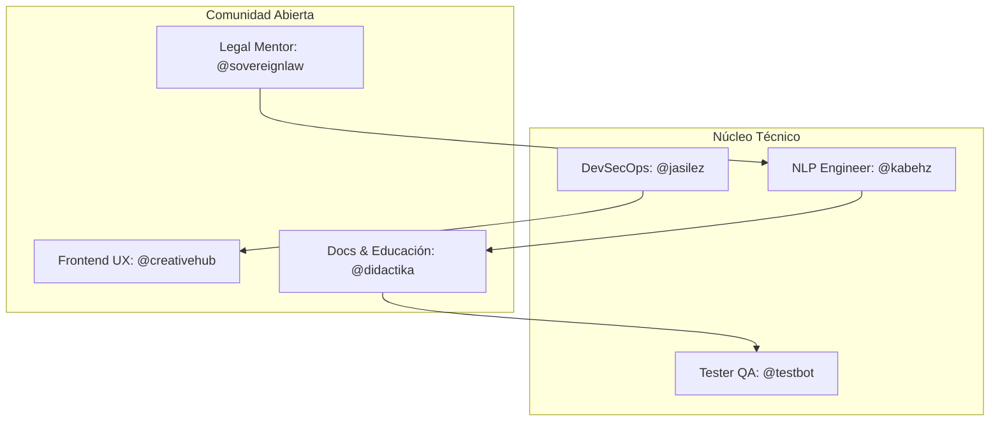

# 🌟 Contribuidores ATLANTYDE

Agradecemos profundamente a quienes aportan su tiempo, energía y visión a este proyecto de soberanía tecnológica y legal.

---

## 🧬 Mapa de Contribución



---

## 🧠 ¿Cómo se organiza el mérito?

Los contribuyentes aparecen según su impacto en:

- 💻 Código
- 📚 Documentación
- 🧪 Pruebas
- 🧭 Diseño pedagógico
- 🤝 Mentoría

Cada Pull Request aceptado suma al árbol de mérito.

---

## 🚀 Refrescar la lista

Para obtener los últimos contribuidores automáticamente:

```bash
git shortlog -sn --no-merges
```

O activa el plugin de MkDocs `git-authors-plugin` para integrar directamente el historial Git en cada página del sitio.

---

## 🤖 Automatización Recomendada

- Mostrar avatar + nombre
- Clasificación por tipo de contribución
- Métricas cognitivas (por ejemplo, número de mejoras pedagógicas)

---

¿Quieres aparecer aquí? ¡Empieza con un [issue de bienvenida](https://github.com/kabehz/atl0s-sdk/issues/new/choose)!

---

## 🙌 Créditos

Gracias a todas las personas, tecnologías y organizaciones que hicieron posible ATLANTYDE.

- Kabehz | Arquitectura cognitiva y legal
- Fundación ATLANTYDE | Visión y soporte
- Comunidad GitHub | Colaboraciones abiertas