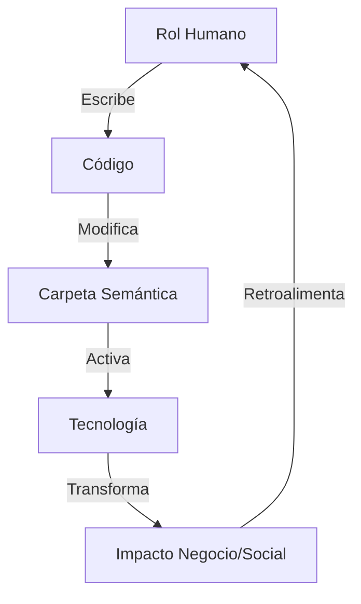

# **Modelo Cognitivo-Operacional\***

---

### 🧭 **1. Mapa Semántico Atl0s: Código ↔ Personas ↔ Impacto**

| Carpeta / Módulo   | Acción Humana               | Rol Humano             | Tecnología Base           | Dominio / Resultado                |
| ------------------ | --------------------------- | ---------------------- | ------------------------- | ---------------------------------- |
| `src/python/`      | Crear lógica semántica      | NLP Engineer           | Python, Transformers      | Validación legal automática        |
| `src/iac/`         | Automatizar infraestructura | DevSecOps              | Terraform, Ansible        | Despliegue reproducible            |
| `docs/`            | Documentar y enseñar        | Educador técnico       | Markdown, MkDocs          | Onboarding, aprendizaje progresivo |
| `tests/`           | Asegurar calidad            | QA / Tester            | Pytest, Shell, OCR        | Fiabilidad semántica y legal       |
| `policies/`        | Formalizar reglas           | Legal Engineer         | OPA, Rego                 | Compliance automatizado            |
| `scripts/`         | Automatizar flujos          | Automator / Maintainer | Bash, Python              | Dev Experience, CI/CD              |
| `roles/`, `learn/` | Aprender, enseñar, escalar  | Contributor / Mentor   | Learning Design, Markdown | Formación por caminos cognitivos   |

---

### 🧠 **2. Inferencia: Cómo las acciones humanas modifican código y desencadenan flujos**

Esto nos lleva a la idea de **GitHub Action contextualizado**: cada cambio en una carpeta representa **una intención**, y el sistema debería responder con inteligencia adaptativa.

---

### 🧬 3. **GitHub Action Custom Python: `semantic-action.py`**

Objetivo: Detectar cambios en carpetas clave y generar acciones semánticas relacionadas, como:

- `learn/` → Generar índice educativo o recomendación de curso
- `tests/` → Ejecutar cobertura extendida
- `src/iac/` → Validar plan Terraform
- `src/python/` → Llamar NLP checker (estilo + tipo entidades legales)
- `docs/` → Extraer y publicar changelog cognitivo

---
